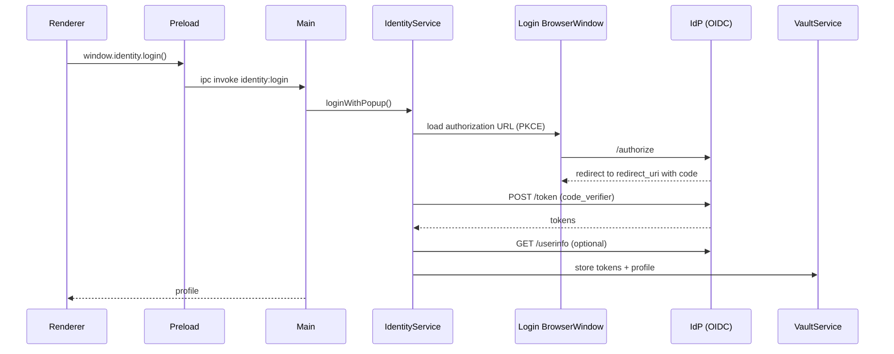
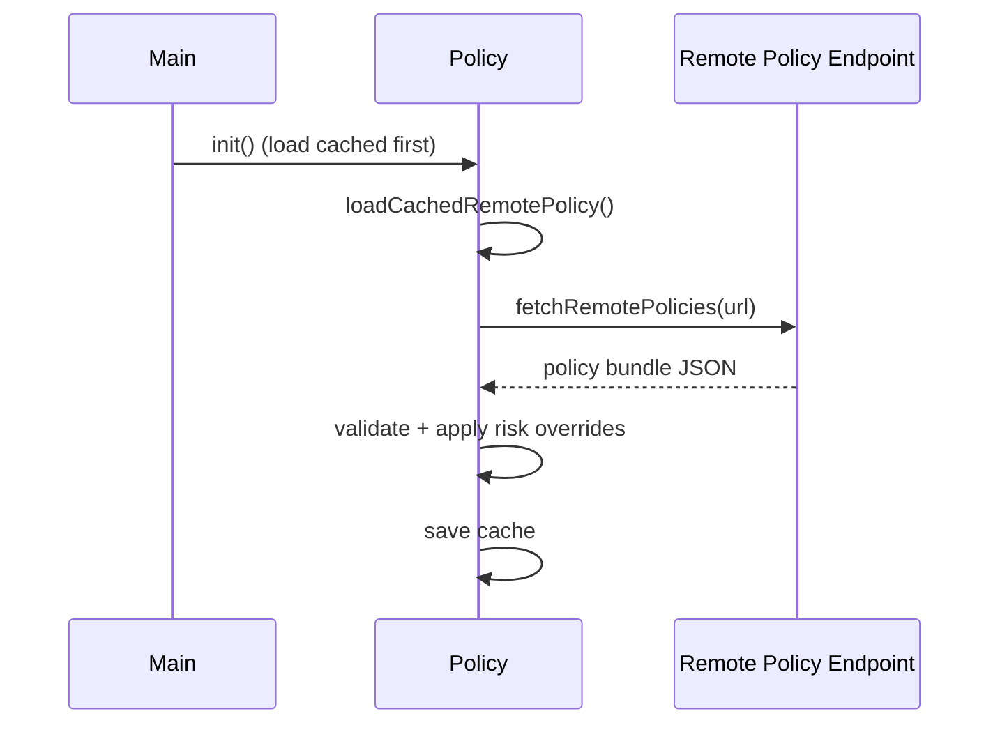
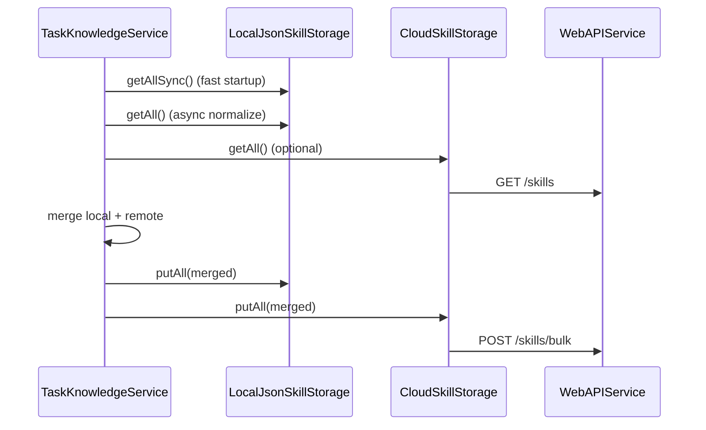

# Architecture Overview

This document describes the core runtime architecture and the enterprise subsystems introduced as part of the v1.0 hardening.

## Process model

```mermaid
flowchart LR
  subgraph Renderer[Renderer (React)]
    UI[UI Components]
    Store[Zustand Store]
  end

  subgraph Main[Electron Main Process]
    Agent[AgentService]
    Tools[ToolRegistry]
    Policy[PolicyService]
    Vault[VaultService (Keytar)]
    Audit[AuditService (SQLite + crypto)]
    Identity[IdentityService (OIDC)]
    Knowledge[TaskKnowledgeService]
    WebAPI[WebAPIService]
  end

  UI -->|IPC via preload| Main
  Store --> UI

  Agent --> Tools
  Tools --> Policy
  Tools --> Audit
  Tools --> Vault

  Knowledge --> WebAPI
  WebAPI --> Identity
  Identity --> Vault
  Audit --> Vault
```

## Identity (OIDC Authorization Code + PKCE)

**Primary files**:

- `electron/services/IdentityService.ts`
- `electron/main.ts` (IPC)
- `electron/preload.ts` (window.identity)



## Remote policy synchronization

**Primary files**:

- `electron/services/PolicyService.ts`
- `electron/main.ts` (IPC + startup init)



### Developer override

`PolicyService.setDeveloperOverride(enabled, token)` checks a Keytar secret (`policy_dev_override_secret`) and allows temporarily bypassing policy decisions.

## Skill sharing (cloud-backed library)

**Primary files**:

- `electron/services/TaskKnowledgeService.ts`
- `electron/services/WebAPIService.ts`



## Auditing and SIEM export

**Primary files**:

- `electron/services/AuditService.ts`
- `electron/main.ts` (periodic ship + rotate)

### Integrity (hash chain)

Each row includes `prev_hash` and `hash`, forming a tamper-evident chain.

### Shipping

When `AUDIT_SHIPPER_URL` is configured:

- Pending logs (where `shipped_at IS NULL`) are batched
- Decrypted payload is re-encrypted with a separate shipper key (`audit_shipper_key`)
- Batches are POSTed to the endpoint

### Retention

Rotation deletes shipped logs older than `AUDIT_RETENTION_DAYS`.
